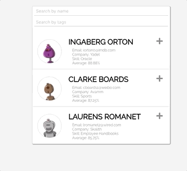
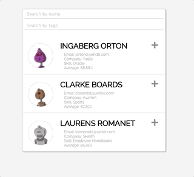

This project was bootstrapped with [Create React App](https://github.com/facebook/create-react-app).

# StudentList

This project is a light student managenet app use to search student by student's infomation. You can either directly find the student profile by name, and meanwhile can add tags to each student and filter by them later.

#### Search by names

#### Add and search by tags

In the project directory, you can run:

## `npm install`

Git clone to local and install the depedencies

## `npm start`

Runs the app in the development mode. 
Open [http://localhost:3000](http://localhost:3000) to view it in the browser.

The page will reload if you make edits. 
You will also see any lint errors in the console.

### Dependencies

-   React
-   babel-loader
-   sass
-   Fetch API
